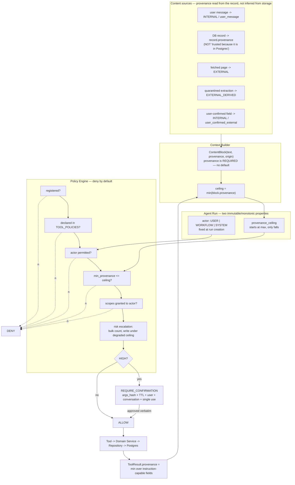

# Architecture v0.3 — Focused Corrections to v0.2

**Status:** Delta document. Read alongside v0.2, which remains the base architecture.
**Scope:** Three corrections and two clarifications. Nothing else in v0.2 is reopened.

---

## A. Change summary

| # | Change | Sections affected in v0.2 |
|---|---|---|
| 1 | **Trust model replaced by a two-axis Actor + Provenance model.** The single `TrustLevel` lattice is removed. Provenance is a property of *records and content*, persisted alongside the data, and it survives storage. Storage location no longer confers trust. | §8.1, §8.2, §6.2, §11 |
| 2 | **Actor authorization separated from data provenance.** `Actor ∈ {USER, WORKFLOW, SYSTEM}` is a property of the run, fixed at creation. Data provenance is a separate, independently-computed ceiling. | §5, §8, §13 |
| 3 | **Policy engine is deny-by-default from M1C.** No permissive stub. Reaching `ALLOW` requires falling through every check. | §19.1, §6 |
| 4 | **Tool policy declarations are mandatory and mechanically enforced** — boot failure, CI failure, and runtime deny, in three independent layers. | §6.2, §18 |
| 5 | **"Always-on deployment target" replaces the vendor-specific VM requirement.** Hetzner becomes an example, not a dependency. | §19.2, §19.3, §15.2 |
| 6 | **Local development and production are explicitly separated,** with a mechanical guard preventing a laptop from connecting to the production database. | New |

Three provenance-related additions to the M1C migration (`provenance`, `origin`, `source_id` on `notes`) and one to `agent_runs` (`actor`, `provenance_ceiling`). No new services, no new datastores, no new frameworks.

**On correction #1, you are right and it's the most important thing either of us has caught.** v0.2's `TOOL_TRUSTED = "results from our own database"` is a laundering hole, and it's the kind that looks fine in a design document and fails in production, because the path from a scraped page to a database row to a context block is exactly the path the M6 feature set creates. Worse, it fails *silently* — nothing would have flagged it. The fix below costs three columns and a propagation rule.

---

## B. Revised trust model

### B.1 Why two axes, and why not five classes

The review proposed splitting Actor from Provenance. That's correct, and the reason is sharper than "they're different": **they have different lifetimes.** The actor is fixed when a run is created and never changes. The provenance ceiling starts high and falls as content enters context. One lattice cannot represent both without one of them corrupting the other — which is exactly what v0.2 did, by putting `SYSTEM` and `USER` (actor concepts) into the same ordering as `UNTRUSTED` and `DERIVED` (data concepts).

The review also proposed five provenance classes: `USER_AUTHORED`, `APPLICATION_GENERATED`, `EXTERNAL_UNTRUSTED`, `DERIVED_FROM_EXTERNAL`, `USER_CONFIRMED_EXTERNAL`. Applying your own §5 rule — *add a distinction only if it solves a concrete problem* — I tested each against the six examples and found that **three ordered levels plus one descriptive field** does the whole job:

| Proposed class | Disposition | Reason |
|---|---|---|
| `USER_AUTHORED` | → `INTERNAL`, with `origin='user_message'` | For *capability* decisions it behaves identically to application-generated data. The distinction matters for attribution and for the fact rule (§B.6), both of which read `origin`, not the level. |
| `APPLICATION_GENERATED` | → `INTERNAL`, with `origin='application'` | Same. |
| `EXTERNAL_UNTRUSTED` | → `EXTERNAL` | Kept. |
| `DERIVED_FROM_EXTERNAL` | → `EXTERNAL_DERIVED` | Kept — the schema-validation constraint is what makes it different, and that difference gates real capabilities. |
| `USER_CONFIRMED_EXTERNAL` | → **a promotion operation, not a level** | See §B.4. Making it a level would require every tool to declare a floor between `EXTERNAL_DERIVED` and `INTERNAL`, and no tool actually wants one. Modelling it as a transition also gets Example F right for free. |

So: **three levels on the ordering, one `origin` string for everything else.** Fewer moving parts than v0.2 had, not more.

### B.2 The two axes

```python
class Actor(StrEnum):
    """Who initiated this run. Fixed at run creation. Immutable."""
    USER     = "user"      # an allowlisted human's message
    WORKFLOW = "workflow"  # a schedule, an event, a monitor
    SYSTEM   = "system"    # maintenance: reaper, purge, backup verify. Never runs the agent.

class Provenance(IntEnum):
    """Where the information originated. Ordered. Survives persistence."""
    EXTERNAL         = 0   # raw content from outside our trust domain, or unconstrained derivation from it
    EXTERNAL_DERIVED = 1   # schema-validated extraction from EXTERNAL, via a tool-less LLM call
    INTERNAL         = 2   # user-authored, application-generated, or user-confirmed external values
```

`origin` is a descriptive, unordered string carried beside the level: `user_message`, `application`, `model_generated`, `external_fetch`, `media_extraction`, `user_confirmed_external`, `correction`. It never participates in a comparison. It exists for attribution ("according to shop.example…"), for the fact rule, and for debugging.

### B.3 The four rules

**Rule 1 — Provenance is a property of records, not of storage.**

Every table whose rows can re-enter a model's context carries:

```sql
provenance     SMALLINT     NOT NULL,   -- the ordered level
origin         TEXT         NOT NULL,   -- descriptive
source_type    TEXT         NOT NULL,   -- 'message' | 'document' | 'media' | 'tool_result' | ...
source_id      UUID         NULL,
derived_from_id UUID        NULL,       -- the record this was extracted from
created_by_run_id UUID      NULL
```

This is the correction. A row read out of Postgres carries the provenance it was written with. `INSERT` is not a promotion. The phrase *"tool-trusted = information from our own database"* is deleted from the architecture; the replacement is **database location does not determine provenance — the record's own `provenance` column does.**

**Rule 2 — Provenance never increases except by explicit user confirmation.**

Any derivation yields `min(inputs)`. Two exceptions, both narrow and both requiring a structural constraint to be paid for:

- **Quarantine promotion** `EXTERNAL → EXTERNAL_DERIVED`: an `EXTERNAL` block passed through an LLM call with **zero tools attached** and a **forced Pydantic schema**, whose output validates. The attacker retains control of values; they lose control of shape. Unvalidated output, or a schema with a free-text field over the length cap, does not promote.
- **User confirmation** `EXTERNAL_DERIVED → INTERNAL`: §B.4.

There is no other code path that raises a provenance value, and the promotion functions live in two files that are named in CI.

**Rule 3 — Tool results carry the minimum provenance of the records that contributed *instruction-capable content*.**

```python
result.provenance = min(
    r.provenance for r in contributing_records
    if result_exposes_text_from(r)
)  # defaults to INTERNAL when the result exposes no external-derived text
```

The qualifier matters, and it's the one place a naive `min()` over all inputs would make the system unusable. Consider `expense_summary` over 200 expenses, one of which came from a receipt photo. A strict `min()` makes the entire summary `EXTERNAL_DERIVED`, which would mean asking "how much did I spend in July?" silently removes your ability to send a message for the rest of the turn. That's the kind of over-strictness that gets a security control switched off.

The principled line: **provenance tracks the capacity of external content to carry an instruction into the model's context.** A `BIGINT` computed by `SUM()` cannot. A free-text merchant name can.

- Numeric, boolean, date, enum, and UUID fields computed by our own SQL over validated columns → `INTERNAL`.
- Any field that passes through externally-originated *text* → retains that text's provenance.

So `expense_summary` returning `{"food": 12450, "transport": 3100}` is `INTERNAL`. `list_expenses` returning rows with `merchant = "…"` strings sourced from receipt OCR is `EXTERNAL_DERIVED`.

**This split is only about capability decisions.** For *attribution*, the full record provenance is always used regardless of type: the assistant says "according to shop.example, the price is ₹9,499", never "the price is ₹9,499". An attacker-chosen number can't inject, but it can mislead, and citation is what handles that.

**Rule 4 — The run has a provenance ceiling, and it only falls.**

```python
run.provenance_ceiling = min(block.provenance for block in working_context.blocks)
```

Computed by the Context Builder, persisted on `agent_runs.provenance_ceiling`, recomputed (downward only) whenever a tool result enters context. It survives the confirmation suspend/resume — a run that dropped to `EXTERNAL_DERIVED` before asking for confirmation resumes at `EXTERNAL_DERIVED`. There is no code path that raises it.

### B.4 User confirmation as a promotion (replacing `USER_CONFIRMED_EXTERNAL`)

Confirmation promotes **a specific validated value at a specific moment**, not a source and not a document.

Preconditions, all required:

1. The value is a **schema-validated field** — scalar, or a string with a declared `max_length ≤ 200`.
2. The value was **rendered verbatim to the user** in the confirmation prompt. Not summarised, not paraphrased.
3. The confirmation resolved via the deterministic yes/no path, matching `args_hash`, within TTL, same user, same conversation, single-use.

Effects:

- A **new record** is written with `provenance = INTERNAL`, `origin = 'user_confirmed_external'`, `derived_from_id = <source record>`, `confirmed_by_run_id`.
- The **source record is not mutated.** The `EXTERNAL_DERIVED` row stays as it was, so the audit trail shows exactly what was confirmed, from what, and when.
- The promotion is **point-in-time**. A later value from the same source is a new `EXTERNAL_DERIVED` record. Confirming today's price does not confirm tomorrow's.

**What can never be promoted:** free-text bodies. If you say "yes, save that whole article as a note", the note body stays `EXTERNAL_DERIVED` permanently, because you did not read every word of it and prose can carry an injection payload. Only field-level, verbatim-rendered, length-capped values promote. This is the constraint that makes promotion safe enough to be worth having.

### B.5 Tool declarations under the new model

`ToolSpec.min_trust` is replaced by two fields:

```python
min_provenance: Provenance          # the lowest ceiling at which this tool stays available
actors: frozenset[Actor]            # which run actors may invoke it at all
```

| `min_provenance` | Tools | Rationale |
|---|---|---|
| `EXTERNAL` | `search_notes`, `expense_summary`, `get_current_time`, `notify_owner` | Read-only over own data, or a fixed-destination notification. Safe in a fully poisoned context. |
| `EXTERNAL_DERIVED` | `create_note`, `add_expense`, `mark_attendance`, `fetch_page` | Writes to own data are permitted with external-derived content in context, **but a write whose ceiling is below `INTERNAL` is automatically promoted to `REQUIRE_CONFIRMATION`.** |
| `INTERNAL` | `delete_*`, `send_message(to=…)`, `send_email`, anything with `SPEND` or `EXEC` | Available only when nothing external-derived is in context. |

### B.6 The fact rule — provenance is not the only control

Provenance governs *capabilities*. A second, independent rule governs *assertions*:

> **Only records with `origin ∈ {user_message, user_confirmed_external, correction}` may be surfaced as facts about the user.**

Everything else — model-generated summaries, extractions, scraped values — is surfaced with attribution and hedging, or not surfaced at all. `recall()` filters on `origin`. This is what stops a conversation summary from becoming an authoritative belief even though it may sit at `INTERNAL` (Example E), and it's why the descriptive `origin` field earns its place beside the ordered level.

### B.7 Persistence rules

| Table | Provenance columns | Notes |
|---|---|---|
| `messages` | ✓ | Inbound user text = `INTERNAL / user_message`. Outbound model text = `min(ceiling of the run that produced it) / model_generated`. |
| `notes` | ✓ | Added to the **M1C** migration. |
| `conversations.summary` | `summary_provenance`, `summary_origin` | Example E. |
| `expenses`, `tasks`, `attendance` (M3) | ✓ | |
| `documents`, `document_chunks`, `extracted_data` (M4/M6) | ✓ | Always `EXTERNAL` or `EXTERNAL_DERIVED` on write. |
| `media_objects` (M5) | ✓ | User-uploaded media is `EXTERNAL` — a photograph is arbitrary content, whoever sent it. |
| `agent_runs` | `actor`, `provenance_ceiling` | Both persisted; ceiling updated downward as the run proceeds. |
| `tool_calls` | `result_provenance`, `ceiling_at_decision` | So a policy decision is reconstructable after the fact. |
| `audit_log`, `llm_calls`, `job_runs` | ✗ | Never re-enter model context. |

**Repository discipline:** repositories return records with provenance attached; the Context Builder reads `record.provenance` and never substitutes a default. A record type without a provenance field cannot be added to a `WorkingContext` — enforced by the `ContentBlock` constructor requiring it, with no default argument. That's the mechanical version of "don't forget."

---

## C. The six examples traced

### A — User-authored note

> "Remember that my preferred currency is INR."

Run: `actor=USER`, ceiling `INTERNAL`. `create_note` requires `EXTERNAL_DERIVED` → allowed; ceiling is `INTERNAL` so no write-confirmation promotion. Row: `provenance=INTERNAL`, `origin='user_message'`, `source_id=<message id>`. Read back next week → `INTERNAL`, ceiling unaffected, and it qualifies as a fact under §B.6. ✓

### B — Scraped price

> Website: "Price: ₹9,499" → `price_minor = 949900` → PostgreSQL

Page fetched → `EXTERNAL`. Quarantined extraction (no tools, forced schema `{price_minor: int, currency: str, in_stock: bool}`) validates → `EXTERNAL_DERIVED`. Stored in `extracted_data` with `provenance=EXTERNAL_DERIVED`, `origin='external_fetch'`, `derived_from_id=<document>`.

**Read back tomorrow: still `EXTERNAL_DERIVED`.** Your expectation is correct and this is precisely the v0.2 bug. Any run that pulls this value into context drops its ceiling to `EXTERNAL_DERIVED` and loses `send_email`, `delete_*`, and every `SPEND`/`EXEC` tool. The Postgres round trip changed nothing.

### C — User confirms the price

> "Yes, that ₹9,499 price is correct. Alert me if it changes."

Preconditions check out: `price_minor` is a scalar from a validated schema, and it was rendered verbatim ("₹9,499 from shop.example — correct?"). Promotion writes a new `confirmed_value` record: `provenance=INTERNAL`, `origin='user_confirmed_external'`, `derived_from_id=<extracted_data row>`, `confirmed_by_run_id`. The original row is untouched.

What is *not* promoted: the page text, the product description, the review snippets, the rest of the extraction schema. Only the field you looked at.

And the monitor's *next* observation is a fresh `EXTERNAL_DERIVED` record — which is what makes Example F work.

### D — Receipt extraction

Uploaded image → `media_objects` with `provenance=EXTERNAL`. (A photograph is arbitrary content; that it came from your phone doesn't make its *contents* yours. A receipt handed to you by someone else is the concrete case.)

Vision extraction with a forced schema (`merchant: str[≤200]`, `total_minor: int`, `currency`, `date`, `line_items`, `confidence`) → `EXTERNAL_DERIVED`. Ceiling drops to `EXTERNAL_DERIVED`.

Model proposes `add_expense(merchant="Absolute Barbecue", amount_minor=85000, ...)`. `add_expense.min_provenance = EXTERNAL_DERIVED` → available. But it's a **write with ceiling < INTERNAL**, so the policy engine promotes it to `REQUIRE_CONFIRMATION` (§D.1 step 7). The prompt renders the actual values verbatim: *"Save ₹850.00 at Absolute Barbecue on 12 Aug 2026 as a Food expense?"*

You say yes → the expense row is written with `provenance=INTERNAL`, `origin='user_confirmed_external'`, `derived_from_id=<extraction>`, `source_media_id`, `confirmed_by_run_id`. `merchant` is under the length cap and was shown verbatim, so it promotes with the amount.

Result: your expense ledger is `INTERNAL` and answers "how much on food last month" without dragging every future turn's ceiling down — which is the practical payoff for making confirmation a promotion rather than a level.

### E — Conversation summary

Generated by our `cheap` model over `messages`. Its provenance is `min()` over the summarised messages: purely user-and-us → `INTERNAL`; a scraped page in the thread → `EXTERNAL_DERIVED`. Being in Postgres contributes nothing.

> *How is it prevented from becoming an authoritative cross-conversation fact?*

Three independent mechanisms, because one wouldn't be enough:

1. **`origin = 'model_generated'`**, so the fact rule (§B.6) excludes it from `recall()` and from anything presented as a belief about you.
2. **Scope lock.** It lives in `conversations.summary`, keyed to one conversation. There is no query path that retrieves another conversation's summary into context, and it is never written to the semantic index.
3. **Regenerability.** It's derivable from verbatim messages that remain in the database, so it's never the system of record. If it's wrong, deleting it is a complete repair.

A summary is a compression of a thread, not a claim about the world. The architecture encodes that in where it can be read from, not just in what it's labelled.

### F — Workflow triggered by scraped data

Monitor detects `price_minor < 1000000`. A run is created: `actor=WORKFLOW`, `provenance_ceiling` **initialised from the triggering event's provenance** = `EXTERNAL_DERIVED`. Both are immutable for the run's lifetime.

> *The workflow wants to send a notification. What stops scraped content from escalating its own capabilities?*

Four things, and the first is the one that actually matters:

1. **The notification primitive has no recipient parameter.** `notify_owner(text)` sends to the allowlisted owner's own registered channel — the destination is fixed in config, not in the arguments. It carries no `EGRESS` scope, because the destination is inside our trust domain. `min_provenance = EXTERNAL` and `actors = {USER, WORKFLOW, SYSTEM}`. Meanwhile `send_message(to=…)` carries `EGRESS`, `min_provenance = INTERNAL`, `actors = {USER}`. So the attacker's best move — making the page say "notify me at attacker@evil.com" — fails on a *missing parameter*, not on a judgement call.
2. **The ceiling is inherited from the trigger and can only fall.** `send_email`, `delete_*`, `SPEND` and `EXEC` tools are absent from the workflow run's tool set. Absent, not refused.
3. **`actors` excludes WORKFLOW** from every HIGH-risk tool. A workflow that needs one raises an asynchronous confirmation to the user; it never auto-executes.
4. **The condition is a declarative comparison**, `extracted_data.price_minor < 1000000`, evaluated by our code. There is no LLM in the trigger path that could be argued into firing.

The notification body is templated from the structured fields (`"{name}: ₹{price} (was ₹{previous}) — {url}"`), not written by a model that read the page, and it's rendered through the egress filter that strips external image sources and off-domain link targets.

**Splitting `notify_owner` from `send_message` is the one behavioural change in v0.3.** It's a tool-design correction, not new machinery — and without it, either price alerts don't work or `send_message` is available at a scraped-data ceiling, and neither is acceptable.

---

## D. Revised policy model

### D.1 Authorization algorithm — deny by default

You're right, and I'll concede this plainly: **v0.2's "M1C returns ALLOW for everything" was a security boundary that temporarily defaulted open.** The rationale (establish the call site first) was sound; the implementation of that rationale was not. It also turns out to be *less* work to do correctly — four explicit declarations is fewer lines than a permissive stub plus a reminder to remove it.

```python
def decide(tool_name: str, args: BaseModel, run: AgentRun) -> Decision:
    # Every step can only DENY or fall through. There is no early ALLOW.

    spec = REGISTRY.get(tool_name)
    if spec is None:
        return DENY("unknown_tool")

    policy = TOOL_POLICIES.get(tool_name)          # separate file from the registry
    if policy is None:
        return DENY("undeclared_tool")              # also a boot failure; see D.3

    if run.actor not in policy.actors:
        return DENY("actor_not_permitted")

    if policy.min_provenance > run.provenance_ceiling:
        return DENY("provenance_ceiling")

    if not policy.scopes <= SCOPES_BY_ACTOR[run.actor]:
        return DENY("scope_not_granted")

    risk = policy.risk
    if policy.bulk_threshold is not None and dry_run_count(tool_name, args) > policy.bulk_threshold:
        risk = RiskLevel.HIGH                       # bulk-effect escalation

    if Scope.WRITE in policy.scopes and run.provenance_ceiling < Provenance.INTERNAL:
        risk = max(risk, RiskLevel.HIGH)            # write under external-derived context

    if risk is RiskLevel.HIGH:
        return REQUIRE_CONFIRMATION(args_hash(args), rendered_effect(tool_name, args))

    return ALLOW()
```

`ALLOW` is reachable only by surviving every check. The absence of a rule is never permission.

Note the two runtime escalations. Bulk escalation was in v0.2. The write-under-degraded-ceiling escalation is new in v0.3 and it's what makes Example D work without a special case: any write proposed while external-derived content is in context requires you to look at the values first.

### D.2 Tool policy declarations

Registration and authorization are **two separate files**, so granting a capability is always its own diff:

```python
# app/tools/registry.py           -- what exists
TOOLS: list[ToolSpec] = [create_note_spec, search_notes_spec, list_notes_spec, get_current_time_spec]

# app/core/policy/declarations.py -- what is permitted
TOOL_POLICIES: dict[str, ToolPolicy] = {
    "create_note":      ToolPolicy(risk=MEDIUM, scopes={WRITE}, min_provenance=EXTERNAL_DERIVED,
                                   actors={USER}, side_effects=REVERSIBLE, data_access={NOTES}),
    "search_notes":     ToolPolicy(risk=LOW,    scopes={READ},  min_provenance=EXTERNAL,
                                   actors={USER, WORKFLOW}, side_effects=NONE, data_access={NOTES}),
    "list_notes":       ToolPolicy(risk=LOW,    scopes={READ},  min_provenance=EXTERNAL,
                                   actors={USER, WORKFLOW}, side_effects=NONE, data_access={NOTES}),
    "get_current_time": ToolPolicy(risk=LOW,    scopes=frozenset(), min_provenance=EXTERNAL,
                                   actors={USER, WORKFLOW, SYSTEM}, side_effects=NONE, data_access=frozenset()),
}
```

A reviewer reading `declarations.py` sees the complete capability surface of the system on one screen. That property is worth protecting as the tool count grows, and it's the reason the two lists aren't merged into one decorator.

### D.3 Mechanical enforcement — three independent layers

**Layer 1 — boot.** `bootstrap.py` runs, before the app can serve or the CLI can accept input:

```python
undeclared = {t.name for t in TOOLS} - TOOL_POLICIES.keys()
orphaned   = TOOL_POLICIES.keys() - {t.name for t in TOOLS}
if undeclared or orphaned:
    raise ConfigurationError(f"undeclared tools: {sorted(undeclared)}; orphaned policies: {sorted(orphaned)}")
```

Both directions. Orphaned declarations matter too — a policy for a tool that was renamed is a rule that silently stopped applying.

Also checked at boot, from v0.2: `spec.credentials ⊆ CREDENTIAL_GRANTS[tool]`, and every `ToolPolicy.data_access` value is a known `DataDomain`.

**Layer 2 — CI.** The same assertions as a plain test, so a pull request fails on GitHub before anyone runs the app. Plus a snapshot test: `declarations.py` is serialised to a golden file, and any change to the capability surface produces a diff in the PR that a reviewer must approve. Adding `EGRESS` to a tool becomes visible, not incidental.

**Layer 3 — runtime.** `TOOL_POLICIES.get(name)` returning `None` denies. Even if layers 1 and 2 were bypassed — a dynamically constructed tool, a test harness, a future plugin path — the answer is still no.

Three layers because the first two are checks and the third is a *property*. Checks can be skipped; the property holds regardless.

### D.4 Policy tests (CI-blocking, from M1C)

| Test | Input | Expected |
|---|---|---|
| Unknown tool | `decide("no_such_tool", …)` | `DENY(unknown_tool)` |
| Registered but undeclared | registry entry with no `TOOL_POLICIES` key | boot raises `ConfigurationError`; and `decide()` returns `DENY(undeclared_tool)` |
| Orphaned declaration | policy key with no registry entry | boot raises `ConfigurationError` |
| M1C tool, clean context | `create_note`, ceiling `INTERNAL`, actor `USER` | `ALLOW` |
| M1C read tool, poisoned context | `search_notes`, ceiling `EXTERNAL` | `ALLOW` |
| Destructive tool | `delete_note`, ceiling `INTERNAL` | `REQUIRE_CONFIRMATION` |
| Destructive tool, degraded ceiling | `delete_note`, ceiling `EXTERNAL_DERIVED` | `DENY(provenance_ceiling)` — not confirmation. Absent, not askable. |
| Write under degraded ceiling | `add_expense`, ceiling `EXTERNAL_DERIVED` | `REQUIRE_CONFIRMATION` |
| Wrong actor | `delete_note`, actor `WORKFLOW` | `DENY(actor_not_permitted)` |
| Bulk escalation | `delete_notes(filter=all)` resolving to 340 rows | `REQUIRE_CONFIRMATION` |
| Accidental registration | a tool added to `TOOLS` with no declaration | **boot failure**, and the test asserts the failure, not a workaround |
| Provenance never rises | property test: no sequence of tool results raises `run.provenance_ceiling` | holds for all generated sequences |
| Ceiling survives suspend | run drops to `EXTERNAL_DERIVED`, suspends on confirmation, resumes | ceiling still `EXTERNAL_DERIVED` |

The last two are property-based rather than example-based, because "provenance never rises" is a claim about *all* execution paths and enumerating them by hand is how the v0.2 hole survived review.

---

## E. Diagram — the changed region only

The v0.2 architecture diagram stands. This replaces the authorization region within it.



The two properties worth reading off the diagram: every arrow out of the policy chain that isn't the last one goes to `DENY`, and the only arrow back into `ceiling` comes from tool results, which can only lower it.

---

## F. Updated M1C / M1D

| Step | v0.2 | v0.3 |
|---|---|---|
| **M1C** | Policy call site returning `ALLOW` for everything | **Policy engine with deny-by-default semantics**: registry lookup, `TOOL_POLICIES` lookup, actor check, provenance ceiling check, scope check. Explicit declarations for exactly the four M1C tools. Boot check (undeclared + orphaned), CI check, golden-file snapshot of the capability surface. `Actor` and `Provenance` enums, `ContentBlock` requiring provenance with no default, `agent_runs.actor` + `provenance_ceiling`, provenance columns on `notes` and `messages`. Policy tests from §D.4 that apply at this stage. |
| **M1D** | Real policy rules introduced | **Full policy semantics on top of a system that was already deny-by-default**: risk tiers and confirmation, `args_hash` binding + TTL + user + conversation + single-use, deterministic yes/no fast path, bulk-effect escalation, write-under-degraded-ceiling escalation, `delete_note` (HIGH, `min_provenance=INTERNAL`), confirmation-as-promotion machinery, remaining policy and security tests. |

The change is small in code and complete in principle: **at no point does a tool exist that is executable without a declaration.** M1C's four tools are declared before they can run; M1D adds semantics to a boundary that was already closed.

M1E and M1F are unchanged. One M1E addition: the Telegram adapter sets `actor=USER` on every run it creates, and there is no path by which a message from a non-allowlisted identity creates a run at all.

---

## G. Updated M2 deployment

### G.1 The requirement, stated correctly

You're right that I encoded a vendor into an architectural requirement. Restated:

> **From M2, the system requires an always-on execution host, because scheduling becomes a user-facing reliability feature.** A reminder that fires four hours late is worse than no reminder, because it destroys trust in the feature. The requirement is *availability*, not a provider.

**Capability requirements for the host:**

| | |
|---|---|
| Availability | Continuously powered and networked; unattended restart after power loss |
| Compute | 2 vCPU / 4 GB RAM minimum (8 GB if local Whisper and local embeddings run there) |
| Storage | 20 GB+ persistent, surviving restarts, snapshot-capable or externally backed up |
| Network out | HTTPS egress to LLM/search providers |
| Network in | Not required until WhatsApp (M7), which needs a public HTTPS endpoint or a tunnel. Telegram long-polling needs no inbound. |
| Runtime | Docker, or Python 3.12 + a system Postgres |
| Clock | NTP-synced — the scheduler's correctness depends on it |

**Acceptable options, all satisfying the above:**
- A small cloud VM at any provider (Hetzner, DigitalOcean, Vultr, OVH, Oracle free tier, AWS Lightsail…). ~$4–6/month is the going rate for this class.
- An always-on machine you own: a home server, a mini PC, a Raspberry Pi 5 with an SSD, a NAS running Docker. **$0 marginal cost**, at the price of your own uptime and your residential connection.
- A managed container host plus managed Postgres, if you'd rather not administer a box. More expensive, less to maintain.

The architecture is agnostic between these. Nothing depends on a provider API, a managed service, or a specific base image — the deploy artefact is a Docker image plus a Postgres connection string. Hetzner appears in the cost table as a *price example*, not as a dependency.

**The one thing I'd flag:** if you choose a home server, the residential-connection and power-outage failure modes are real but they degrade the same way a laptop does, just less often — the catch-up policy handles it. Any of these options is a large improvement over "the laptop, if it's awake."

### G.2 Local development vs production

Two environments, two databases, no crossing.

```
Laptop (APP_ENV=dev)                    Always-on host (APP_ENV=prod)
├── Docker: postgres:16 (local)         ├── Docker: postgres:16 (prod data)
├── api + worker on the host            ├── api + worker containers
├── CLI provider, FakeLLM by default    ├── Telegram (+ WhatsApp from M7)
├── seeded synthetic data               ├── your real data
└── dev/.env — dev secrets only         └── prod/.env — on the host only, never on the laptop
```

**The mechanical guard.** Config alone isn't enough — a mistyped `DATABASE_URL` is exactly the kind of thing that happens at 1 a.m. So the database itself declares which environment it is:

```sql
-- written by the first Alembic migration, one row
system_settings(key='environment', value='dev' | 'prod')
```

On startup the app reads it and refuses to run if it doesn't match `APP_ENV`:

```
FATAL: APP_ENV=dev but the database at <host> is marked 'prod'. Refusing to start.
```

The check is in `bootstrap.py`, before any session is opened for application use, and it's tested. A laptop pointed at production fails in under a second with a clear message, rather than writing test notes into your real ledger.

**Migrations.** Forward-only, one per PR, `--autogenerate` always reviewed by hand (it misses index changes, enum alterations and constraint renames). Applied **on the production host as an explicit deploy step** — `make deploy` does pull → `alembic upgrade head` → restart — never from the laptop over a remote connection. Destructive changes use expand/contract: add column → backfill in a job → dual-write → switch reads → drop in a later release. Dev migrations run automatically on container start, because dev data is disposable.

**Test data.** `scripts/seed.py` is idempotent, generates synthetic notes/expenses/conversations, and **hard-refuses to run when `APP_ENV=prod`**. Integration tests use testcontainers — an ephemeral Postgres per run that touches neither environment.

**When you need realistic data locally**, `make pull-redacted-dump` restores a production dump into dev with message bodies, note bodies, and media keys scrubbed. Worth being explicit about the tradeoff: since you are the only user, "redaction" is protecting you from your laptop's threat model, not from another person's privacy. Use the synthetic seed by default; pull a redacted dump only when reproducing a specific bug, and drop it afterwards.

**Backups** are a production-only concern: nightly `pg_dump` + WAL archiving to off-box storage (30-day retention), object storage synced for originals only, and a **monthly automated restore drill** into a scratch database verified by row counts and a spot check. Dev is never backed up, because losing it costs one `make seed`.

**Configuration separation:** `.env.dev` and `.env.prod` are never both present on a machine. `.env.example` documents every key with no values. Production secrets live on the production host (SOPS+age, or the host's secret manager); the laptop holds only dev credentials and a deploy key. A leaked laptop therefore exposes synthetic data and a revocable key, not your ledger.

---

## H. Decision matrix — changed rows only

| # | Decision | v0.2 | v0.3 | Status | Reason |
|---|---|---|---|---|---|
| D7 | Policy engine timing | Call site at M1C returning ALLOW; rules at M1D | **Deny-by-default semantics at M1C** with explicit declarations for the four M1C tools; full semantics at M1D | **MODIFY** | A security boundary must not default open, even temporarily. It's also less work. |
| D12 | Tool registration | Explicit registry | Explicit registry **plus a separate mandatory policy declaration**; missing or orphaned → boot failure, CI failure, runtime deny | **MODIFY** | Registration must not imply permission. Capability grants get their own diff. |
| D13 | Injection defense | Single `TrustLevel` lattice; `TOOL_TRUSTED` = our own database | **Two axes: `Actor` (3, immutable per run) + `Provenance` (3, monotonically non-increasing).** Provenance persisted per record; storage location confers nothing | **MODIFY** | v0.2 laundered external data through Postgres. Net result is *fewer* concepts: 5 mixed levels → 3 + 3 orthogonal. |
| D13a | Confirmation semantics | Approves an action | Approves an action **and promotes the specific validated fields it rendered verbatim** to `INTERNAL` | **NEW** | Makes user-confirmed external data usable without a fourth lattice level. Field-scoped, point-in-time, never prose. |
| D13b | Notification capability | `send_message` covers all outbound | **`notify_owner` (no recipient parameter, no EGRESS, available to WORKFLOW) split from `send_message(to=…)` (EGRESS, `min_provenance=INTERNAL`, USER only)** | **NEW** | Lets scrape-triggered alerts work without granting egress at an external-derived ceiling. |
| D22 | Deployment | VM at M2 (Hetzner named) | **Always-on host at M2**; capability requirements specified; provider is an example | **MODIFY** | Availability is the requirement; the vendor is not. |
| D33 | Dev/prod boundary | Implicit | **Two databases, `system_settings.environment` guard refusing mismatched startup, migrations applied only on the prod host, seed refuses prod, backups prod-only** | **NEW** | Follows directly from D22 and prevents a whole class of accident. |

All other rows in the v0.2 matrix are unchanged.

---

## I. What did *not* change

Explicitly, so nothing regresses: SQL authoritative for structured facts; the LLM as interface and orchestrator, never the database; explicit tool registry; policy engine in the execution path; confirmation bound to exact stored arguments and executed verbatim without re-planning; credential isolation via pre-authenticated clients and the `CredentialBroker`; external web content untrusted; isolated fetcher with Playwright as escalation; Agent Runtime as a persisted state machine; modular monolith; CLI → Telegram → WhatsApp; three memory stores plus one semantic index; explicit memory only with no silent automatic long-term memory; pgvector deferred to M4; queue library deferred to M2; debug console at M2.5; event outbox designed early with the dispatcher deferred; audit/trace/conversation/tool-result separation.

**No additions to the dependency footprint.** v0.3 adds two enums, three columns on a few tables, one dictionary in one file, three startup assertions, and one tool split. No second authorization framework, no security service, no additional datastore, no message bus.

**The one honest cost:** provenance columns on every context-reachable table, and the discipline of populating them at every write. That's a real tax on every future domain — roughly three columns and one propagation line per table. It's cheap now and it is the single most expensive thing to retrofit, which is the same argument that put `user_id` on every table from day one.

---

## J. Implementation gate

**v0.3 is ready for implementation.**

The security property you named in §14 now holds structurally rather than by convention:

| The LLM cannot grant itself… | Prevented by |
|---|---|
| a capability | Deny-by-default policy + mandatory declarations in a separate file + boot/CI/runtime enforcement |
| a credential | Pre-authenticated clients; `CredentialBroker` grants checked at boot; no tool declares `CREDENTIALS` data access |
| elevated trust | `Provenance` is monotonically non-increasing; the only two promotions require either schema validation with no tools attached, or an explicit user confirmation of a verbatim-rendered field |
| permission to bypass confirmation | `args_hash` + TTL + user + conversation + single-use; the yes/no path is deterministic and never reaches a model; resume executes the stored call, never a re-planned one |
| permission to treat external data as user-authored fact | Provenance persists across storage; the fact rule filters on `origin`; confirmation promotes fields, never prose |

Three items remain open **by design**, unchanged from v0.2 and none of them blocking: the queue library (decided at M2 behind the `JobQueue` interface), the embedding model (benchmarked at M4 against your real corpus), and WhatsApp's post-October-2026 pricing (an external unknown to verify against Meta's documentation before M7, affecting cost rather than structure).

**What I need before starting M1A:**

1. Approval of v0.3 — in particular the three-level provenance model in place of your five-class vocabulary (§B.1), the instruction-capability refinement to result provenance (§B.3 Rule 3, which prevents `expense_summary` from degrading every turn's ceiling), and the `notify_owner` / `send_message` split (§C-F).
2. Your choice of always-on host class — cloud VM, hardware you own, or managed — so M2's deploy step targets something concrete. Not needed until M2.
3. Whether the Meta Business verification paperwork starts now (recommended: yes; it's an hour of your time and then it runs in other people's queues for weeks).

Telegram token and Anthropic key remain unneeded until M1E and M1B respectively, and M1B is fully testable against `FakeLLM` first.

On approval, M1A is roughly a day: repo, compose, migrations, config, logging, CI, import-linter, and a CLI that echoes. Deliberately small — it's the step where the tooling either works or it doesn't, and finding that out should cost a day rather than a milestone.
